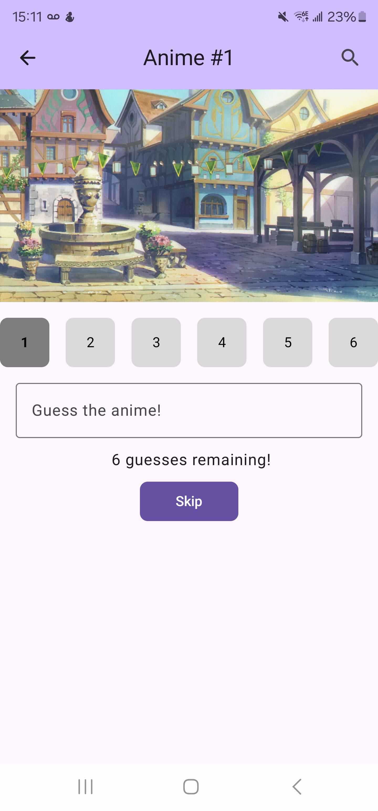
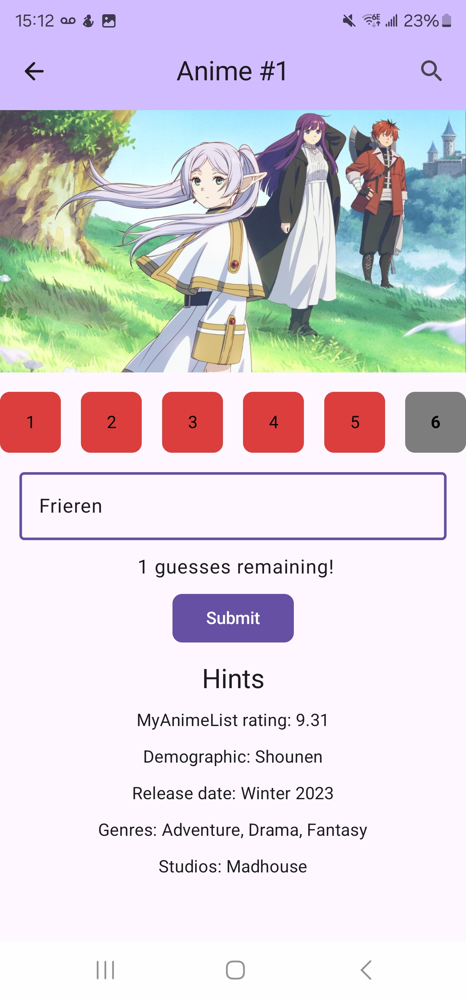
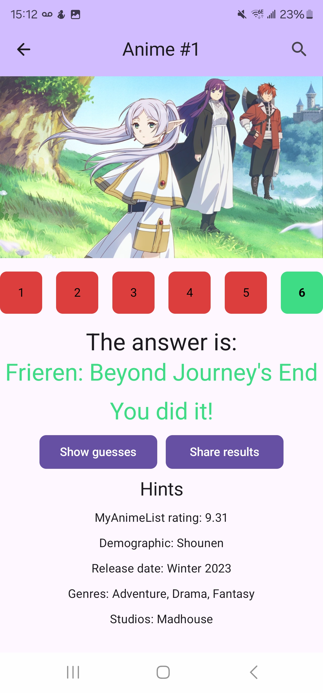
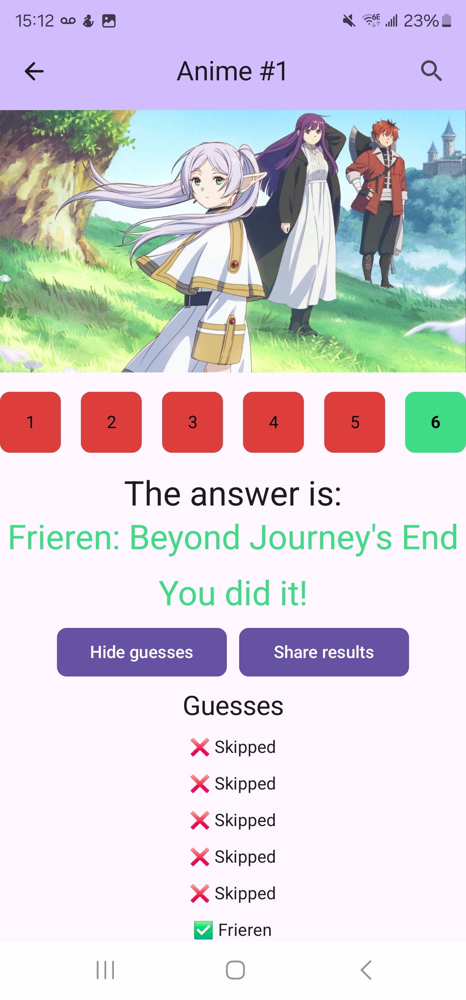
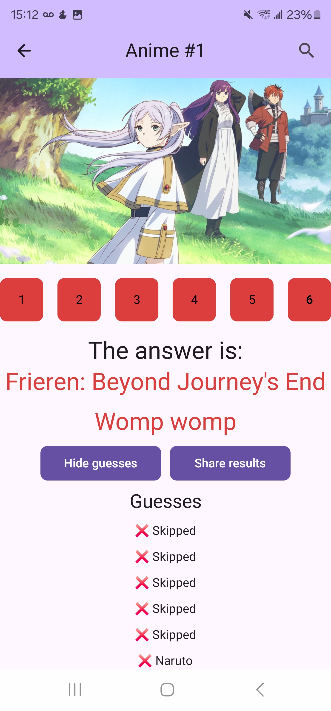

# Nerd Guesser
NerdGuesser is an app meant to have daily games (like Wordle) that are bawsed on my nerdy interests, like guessing an anime with 6 frames or less.
I am developing this as a means for improving my Android development skills using Jetpack Compose, and to hopefully satitate my desire for my nerdy daily guessing games.

Cloud functions for Firebase:
[Nerd Guesser Cloud Functions](https://github.com/Wavedoo/NerdGuesser-CloudFunctions)

Rough design made using Figma:
[Nerd Guesser Figma](https://www.figma.com/design/rMqinEH1TkVJGsNiXSeaHT/Nerd-Guesser?node-id=16-4&t=0Y6q78jmnvD6xqzP-1)

## Features
- Utilizes Jetpack Compose
- MVVM based architecture
- NavHost for navigation
- Firebase for backend
- Dependency injection using hilt

Upcoming:

- More screens
- More games

## Screenshots
Guessing screens

 

Various results screens

    

## Setup
Requires a setup firebase project.

### Firestore Schema
AnimeFrameGuesser <br/>
id - autogenerated ID <br/>
name - Name of anime <br/>
day - The game number <br/>
imageFolder - Folder to `AnimeFrameGuesser` subfolder <br/>
hints - Array of hints for the game: <br/>
  1 - MyAnimeList rating <br/>
  2 - Target demographic <br/>
  3 - Release date <br/>
  4 - Genres <br/>
  5 - Studios <br/>
  

```
{
  id: String,
  name: String,
  day: Int,
  imageFolder: String,
  hints: [String, String, String, String, String]
}
```
AnimeFrameDays
list - ordered array of IDs from `AnimeFrameGuesser`
```
{
  list: [string, string, ..., string]
}
```

### Storage
`AnimeFrameGuesser/` - Main folder <br/>
`<name>/` - Anime name <br/>
`<images>/` - Images numbered 1 to 6
```
AnimeFrameGuesser/
  naruto/
    1.jpg
    2.jpg
    3.jpg
    4.jpg
    5.jpg
    6.jpg
```
